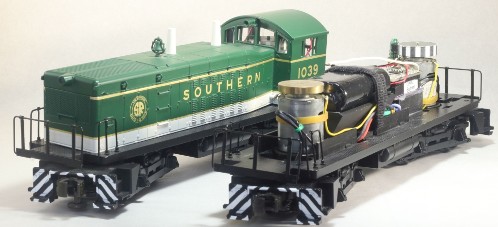

# Model-Train-Engine-Control
If you're a DIYer who enjoys model trains and hobbiest level electronics, and would like to convert your model train engines to radio control and battery power, then this material is for you.

.

Code and other material here was created by me to convert my O scale engines to radio control and battery power.  Figure 1 shows an NW-2, one of my smaller engines, with control logic I created and LiPo battery power that can run the engine for hours.  With this accomplishment I'm certain the remainder of my O scale engines can be converted similarly.  There's enough information here to support your doing the same kind of conversions: all of my supporting code, KiCAD design files for a custom PCB, and FreeCAD  design files for 3D printed parts.  A reasonably detailed instruction manual will follow.
